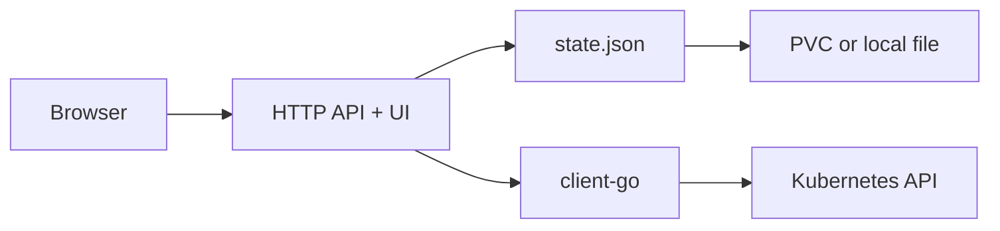

# Kube Tenant Console

Kube Tenant Console is a small internal tool for preparing namespace-based tenants in Kubernetes.

It keeps a small local state, generates standard Kubernetes objects, shows YAML previews, and lets an admin apply or remove managed resources from one UI.

No CRDs. No controller loop. Just standard Kubernetes resources.

## Background

This project is a personal clean-room implementation inspired by recurring Kubernetes tenant onboarding work: creating namespaces, quotas, RBAC roles, service accounts, and kubeconfigs by hand.

It does not contain proprietary code, internal configuration, or company-specific workflows.


## What It Creates

- `Namespace`
- `ResourceQuota`
- `LimitRange`
- `Role`
- `RoleBinding`
- `ServiceAccount`
- kubeconfig output for a namespace service account

## Typical Flow

1. Create a tenant.
2. Create one or more namespaces for it.
3. Set quota and default container limits.
4. Create namespace RBAC roles.
5. Create service accounts.
6. Bind users, groups, or service accounts to roles.
7. Preview YAML.
8. Apply it to the cluster.
9. Issue a kubeconfig when a service account needs access.

## How It Works



The app has two sources of information:

- `state.json` - what was created through this tool;
- Kubernetes API - what currently exists in the cluster.

The state file is intentionally boring. It is easy to inspect, back up, copy, or replace.

## Project Layout

- `cmd/server` - starts the process and wires dependencies.
- `internal/domain` - app models and validation.
- `internal/local` - JSON state storage and local mutations.
- `internal/kube` - Kubernetes client, object builders, apply/delete logic.
- `internal/httpapi` - HTTP handlers and embedded UI.
- `deploy/helm/kube-tenant-console` - Helm chart.

UI note: the browser UI is mostly AI-assisted prototype work. The main part of the project is the Go backend and Kubernetes object flow.

## Run Locally

```sh
go run ./cmd/server
```

Then open:

```text
http://localhost:8080
```

By default it writes state to:

```text
./data/state.json
```

Useful env vars:

```text
ADDR=:8080
DATA_PATH=./data/state.json
KUBECONFIG=/path/to/kubeconfig
ALLOW_CLUSTER_SCOPE=false
```

If `KUBECONFIG` is not set, the app tries in-cluster config first and then the default local kubeconfig.

## Run With Docker

```sh
docker build -t lrbac:latest .
docker run --rm -p 8080:8080 -v "$PWD/data:/app/data" lrbac:latest
```

With local kubeconfig:

```sh
docker run --rm -p 8080:8080 \
  -v "$HOME/.kube:/kube:ro" \
  -v "$PWD/data:/app/data" \
  -e KUBECONFIG=/kube/config \
  lrbac:latest
```

## Run In Kubernetes

```sh
helm upgrade --install kube-tenant-console ./deploy/helm/kube-tenant-console \
  --namespace kube-tenant-console \
  --create-namespace
```

Open it with port-forward:

```sh
kubectl port-forward -n kube-tenant-console svc/kube-tenant-console 8080:80
```

For Docker Desktop Kubernetes with a local image:

```sh
docker build -t lrbac:latest .

helm upgrade --install kube-tenant-console ./deploy/helm/kube-tenant-console \
  --namespace kube-tenant-console \
  --create-namespace \
  --set image.repository=lrbac \
  --set image.tag=latest \
  --set image.pullPolicy=Never
```

## Security

This tool is meant for trusted internal access: port-forward, VPN, bastion, or a private admin network.

Do not expose it directly to the internet. The backend may run with broad Kubernetes permissions because it needs to create namespaces and RBAC objects.

The app also refuses some dangerous RBAC rules by default:

- `impersonate`
- `secrets`
- `nodes`
- `persistentvolumes`
- `clusterroles`
- `clusterrolebindings`
- `roles`
- `rolebindings`
- `pods/exec`
- `pods/attach`
- `pods/portforward`

Cluster-scoped role templates are off unless `ALLOW_CLUSTER_SCOPE=true`.

## State

In the Helm deployment the state file usually lives here:

```text
/data/state.json
```

With the current JSON store, run one replica. If the state needs to be backed up, back up the file or the PVC.

## Test

```sh
go test ./...
```

## Possible Next Steps

- Add simple admin login using a Kubernetes Secret.
- Move state to S3-compatible storage with locking.
- Add an audit screen for local state changes.
